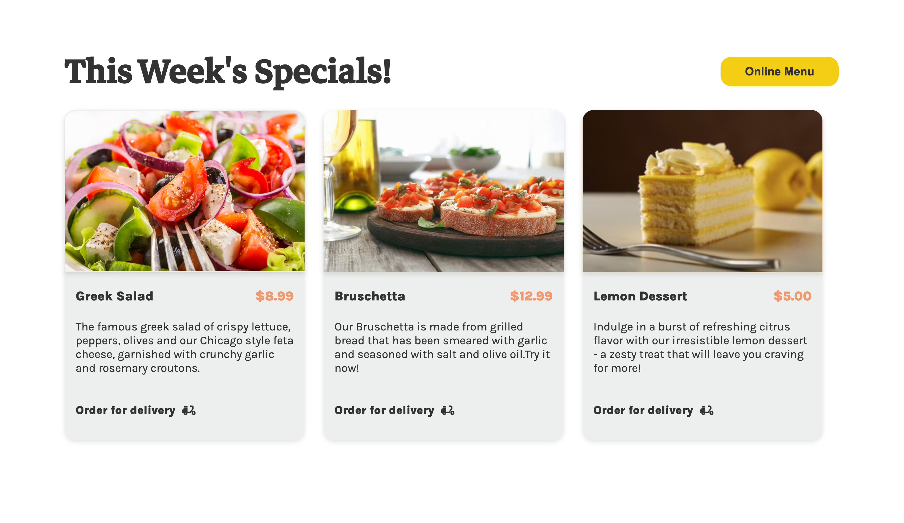
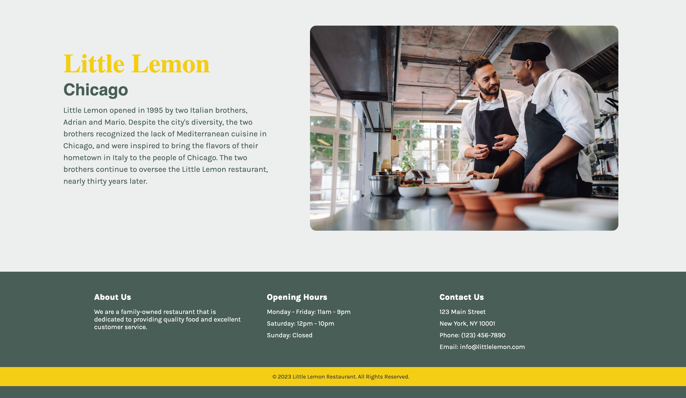

# Little Lemon Restaurant

This is a responsive website for Little Lemon Restaurant, a fictional restaurant that allows customers to reserve a table and view the highlights and dishes of the week. The website was built using React and designed using Figma.
live :https://little-lemonn.netlify.app

## Table of Contents
- [Installation](#installation)
- [Screenshots](#screenshots)
- [Contributing](#contributing)

## Installation
To install the project, first clone the repository:

git clone https://github.com/nikhilktom/Little-Lemon.git

Then, navigate to the project directory and install the dependencies:

cd my-app
npm install

To start the development server, run: npm start

This will start the website at http://localhost:3000.

To build the website for production, run: npm run build

This will create an optimized build of the website in the `build` directory.

## Screenshots
Here are some screenshots of the Little Lemon Restaurant website:

## Contributing
Contributions to the project are welcome! If you find a bug or have a feature request, please open an issue on the [GitHub repository](https://github.com/nikhilktom/Little-Lemon.git).

